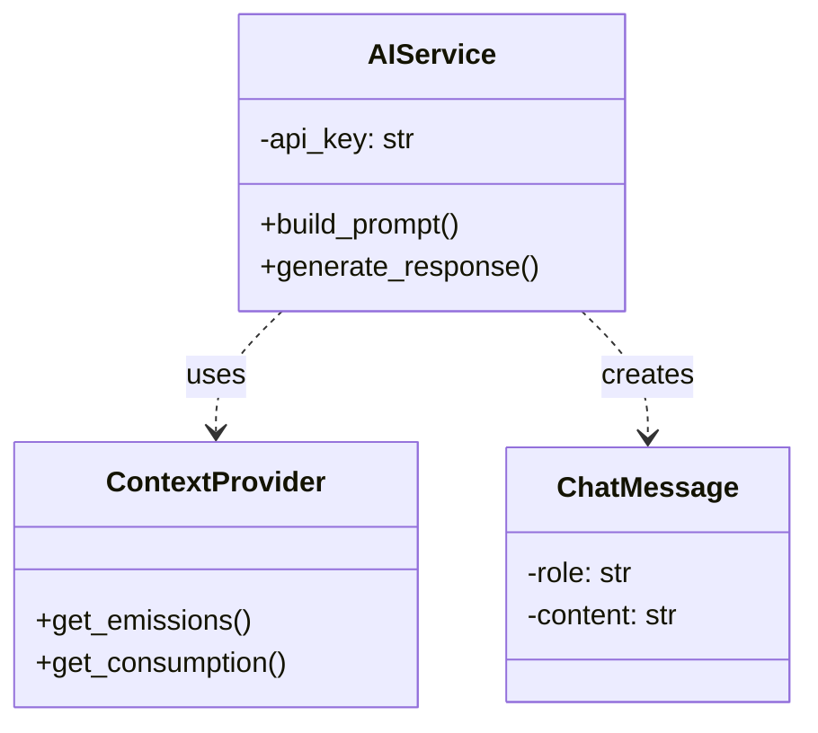

```mermaid
classDiagram
    class AIService {
        -api_key: str
        +build_prompt()
        +generate_response()
    }

    class ContextProvider {
        +get_emissions()
        +get_consumption()
    }

    class ChatMessage {
        -role: str
        -content: str
    }

    %% Relationships
    AIService ..> ContextProvider : uses
    AIService ..> ChatMessage : creates
```
